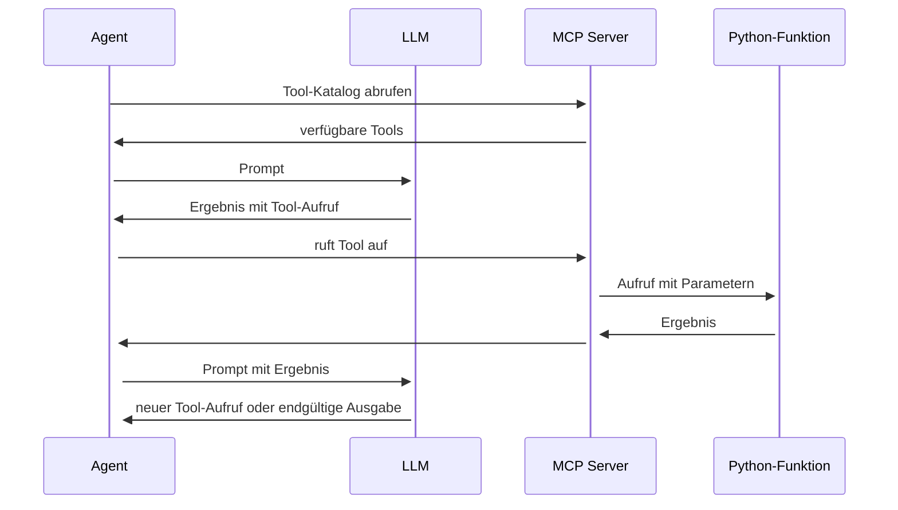

# Agenten

Die meisten Agenten-Schleifen sind Umsetzungen des ReAct-Patterns (Reason + Act), das 2022 in einem Paper von Google Research vorgestellt wurde. Der Agent wechselt zwischen zwei Modi:

    Reasoning — durchdenken, was zu tun ist, warum, und was voraussichtlich passieren wird
    Acting — ein Tool aufrufen, Code ausführen oder eine andere konkrete Aktion durchführen

Oder etwas detaillierter:

1. der Host schickt den Prompt **und alle Tool-Schemas** an das LLM
2. das LLM antwortet mit Text oder mit einem **Tool-Aufruf** (`tool_use`-Block)
3. der Host führt den Aufruf auf dem MCP Server aus
4. das Ergebnis wandert zurück in den Kontext, und die Schleife beginnt von vorn
5. die Schleife endet, wenn die Aufgabe erledigt ist oder ein Schritt- bzw. Token-Limit erreicht ist

Das ist das **ReAct**-Pattern: *Reason → Act → Observe → Repeat*.

> Agenten in einer Schleife laufen zu lassen erfordert ein großes Kontextfenster!

----

## Wann endet der Agent Loop?

Jede Schleife braucht einen Ausgang. Übliche Abbruchbedingungen sind:

- Aufgabe erledigt
- Maximale Anzahl an Iterationen erreicht (z.B. 50 Schritte)
- Kontextfenster- oder Kostenlimit erreicht
- Menschlicher Checkpoint — Pausieren und auf Bestätigung durch den Benutzer warten
- Zu viele Fehler hintereinander, Abbruch
