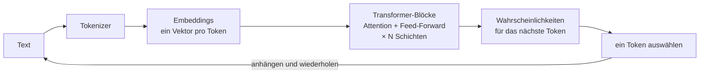

# Grundlagen

## Architektur eines LLM

### Übung 1: Lückentext

Setze die Wörter ein:
**neuronales Netz, LLM, Kontext, Tokens, Prompt, User Prompt, System Prompt, Temperatur**

> Ein \_\_\_\_\_\_\_\_ ist ein mathematisches Modell aus vielen Schichten einfacher Einheiten.
> Ein \_\_\_\_\_\_\_\_ ist ein sehr großes davon, trainiert darauf, das nächste Wort vorherzusagen.
> Vor der Verarbeitung wird Text in \_\_\_\_\_\_\_\_ zerlegt.
> Den Text, den wir an das Modell schicken, nennt man \_\_\_\_\_\_\_\_.
> Er besteht aus einem \_\_\_\_\_\_\_\_, den die Entwickler\*innen der Anwendung schreiben,
> und einem \_\_\_\_\_\_\_\_, den die Person eintippt, die die Anwendung benutzt.
> Alles, was das Modell auf einmal sehen kann, nennt man \_\_\_\_\_\_\_\_.
> Die \_\_\_\_\_\_\_\_ steuert, wie zufällig die Wahl des nächsten Tokens ist.

Lösung

neuronales Netz, LLM, Tokens, Prompt, System Prompt, User Prompt, Kontext, Temperatur

### Von Neuronen zu Transformern

- ein **Neuron** multipliziert seine Eingaben mit Gewichten, summiert sie auf und wendet eine nichtlineare Funktion an
- ein **neuronales Netz** stapelt viele Schichten von Neuronen; beim Training werden die Gewichte angepasst
- Text wird in **Tokens** (Wörter oder Wortteile) zerlegt, und jedes Token wird in einen Vektor umgewandelt (**Embedding**)
- ein **Transformer** verwendet **Attention**: jedes Token betrachtet alle vorherigen Tokens, um zu entscheiden, was wichtig ist
- die Ausgabe ist eine Wahrscheinlichkeit für jedes mögliche nächste Token
- ein **LLM** macht nichts anderes als **Next-Token-Prediction** – immer und immer wieder

----

## Aktuelle Modelle

| Modell | Anbieter | Open Weights | Parameter | Kontext (Tokens) |
|-------|--------|:------------:|-----------:|-----------------:|
| GPT-3 (2020, zum Vergleich) | OpenAI | nein | 175 Mrd. | 2 K |
| GPT-5.3 | OpenAI | nein | ? | 128 K |
| Claude Sonnet / Opus / Fable | Anthropic | nein | ? | 1 M |
| Gemini | Google | nein | ? | ≥ 1 M |
| DeepSeek-V4-Pro | DeepSeek | ja | 1,6 Bio. (49 Mrd. aktiv) | 1 M |
| DeepSeek-V4-Flash | DeepSeek | ja | 285 Mrd. (13 Mrd. aktiv) | 1 M |
| Qwen3-Max | Alibaba | nein | > 1 Bio. | 1 M |
| Qwen3-0.6B | Alibaba | ja | 0,6 Mrd. | 32 K |

- **Frontier-Modelle** laufen in der Cloud des Anbieters. Sie sind die stärksten, aber deine Daten verlassen das Haus.
- **Open-Weight-Modelle** können heruntergeladen und lokal ausgeführt werden (z.B. mit Ollama). Sie sind schwächer, aber du behältst die Kontrolle.

**Frage:** Welche dieser Modelle hast du schon benutzt? Wie gut waren sie?

### Übung 2:

Schau dir [Simon Willisons Pelikan-Sammlung](https://simonwillison.net/tags/pelican-riding-a-bicycle/) an. Was sagen die Bilder über die praktischen Grenzen von LLMs aus?

## LLMs haben sich deutlich verbessert

- **Tool Use:** Modelle sind darauf trainiert, strukturierte Tool-Aufrufe auszugeben (darauf baut MCP auf)
- **Reasoning:** Modelle "denken" in zusätzlichen Tokens, bevor sie antworten
- **längerer Kontext:** von 2 K auf 1 M Tokens in 6 Jahren
- **Agents:** Modelle rufen Tools in einer Schleife auf, bis eine Aufgabe erledigt ist
- **Training:** Modelle werden gezielt darauf trainiert, strukturierte Ausgaben wie Programmcode oder JSON zu liefern

## Einige Einschränkungen bleiben

- **Kontext:** ist immer noch eine knappe Ressource: alles, was das Modell über deine Aufgabe weiß, muss in den Kontext passen: System Prompt, Konversation, Tool-Beschreibungen und Tool-Ergebnisse.
- Modelle finden Details in sehr langen Kontexten schlechter
- jedes angebundene MCP-Tool kostet Kontext, auch wenn es nie benutzt wird
- Modelle halluzinieren immer noch
- Modelle können immer noch nicht denken, rechnen oder logischen Ketten folgen, die tiefer sind als die Tiefe des LLM. Sie sind jedoch gut darin, Code zu schreiben, der die tieferen Berechnungen durchführt.

### Übung 3: Fibonacci

Untersuchen wir die Fähigkeiten eines LLM anhand der Fibonacci-Folge (0, 1, 1, 2, 3, 5, 8, ...).

1. Bitte ChatGPT (oder ein anderes LLM), die 5. Fibonacci-Zahl zu berechnen, dann die 100., die 231. oder eine noch höhere – **ohne** es Code ausführen zu lassen.
2. Schreibe eine Python-Funktion `fibonacci(n)`, die die n-te Zahl der Fibonacci-Folge zurückgibt.
3. Vergleiche die Ergebnisse.

> Warum sollte ein LLM eine Funktion aufrufen, statt die Antwort zu "wissen"?

----

## Reflexionsfragen

Sammelt und diskutiert:

1. Wo setzt du in deinem Unternehmen **heute** KI ein?
2. Welche Aufgaben könnte eine KI **in Zukunft** erledigen, wenn sie Zugriff auf deine Systeme hätte?
3. Auf welche Systeme müsste sie zugreifen?
