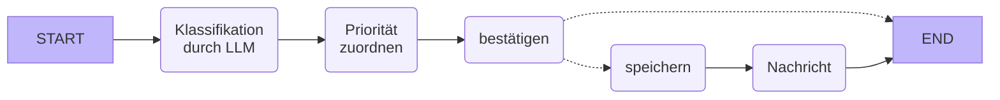
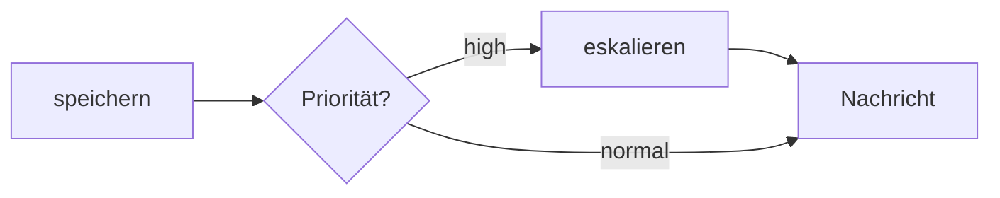

# Workflows mit LangGraph

Ein **Agent** entscheidet selbst, welches Tool er als Nächstes aufruft.
Ein **Workflow** legt die Schritte fest – das LLM wird nur dort gefragt, wo es gebraucht wird.

### Ein Beispiel-Workflow für Incidents



In **LangGraph** besteht ein Workflow aus:

| Begriff | Bedeutung |
|---------|-----------|
| **State** | ein Dictionary, das von Schritt zu Schritt weitergereicht wird |
| **Node** | eine Python-Funktion, die den State liest und Änderungen zurückgibt |
| **Edge** | legt fest, welcher Node als nächstes kommt |
| **Conditional Edge** | eine Funktion entscheidet, welcher Node als nächstes kommt |

Die Bibliothek `langchain-mcp-adapters` macht MCP Tools in LangGraph verfügbar:

```python
from langchain_mcp_adapters.client import MultiServerMCPClient

mcp_client = MultiServerMCPClient(
    {"incidents": {"url": "http://localhost:8000/mcp", "transport": "streamable_http"}}
)
tools = await mcp_client.get_tools()
```

----

## Übung 1: Einen Workflow ausführen

### Schritt 1: Ein eigenes Projekt anlegen

`langchain-mcp-adapters` benötigt eine ältere Version des `mcp`-Pakets als FastMCP.
Da der Workflow nur ein Client ist, bekommt er ein eigenes Projekt.

Erstelle ein neues Verzeichnis und lege dort ein Projekt an:

```bash
uv init workflow
cd workflow
uv add langgraph langchain-mcp-adapters langchain-ollama
ollama pull qwen3:0.6b
```

### Schritt 2: Den Workflow starten

Starte den Incident-Server aus [code/incident_mcp.py](code/incident_mcp.py) im ersten Terminal.
Lade [code/graph/incident_workflow.py](code/graph/incident_workflow.py) in das Projekt `workflow` und starte es:

```bash
uv run incident_workflow.py
```

Das Skript gibt den Graphen als Mermaid-Diagramm aus. Füge ihn in [mermaid.live](https://mermaid.live) ein.

### Schritt 3: Den Code lesen

- Welcher Node verwendet das LLM? Welcher ein MCP Tool?
- Wie kommt die Klassifikation des LLM in eine Pydantic-Klasse?
- Ändere die Nachricht in `__main__` und probiere verschiedene Incidents aus.

----

## Übung 2: Eskalation

Incidents mit hoher Priorität sollen zusätzlich an die IT-Leitung eskaliert werden.



Füge einen Node `escalate` und eine Conditional Edge hinzu.

<details>
<summary>Lösung</summary>

```python
def escalate(state: State) -> State:
    print("🚨 escalated to the IT manager")
    return {}


def route(state: State) -> str:
    return "escalate" if state["priority"] == "high" else "notify"


graph.add_node(escalate)
graph.add_conditional_edges("record", route, ["escalate", "notify"])
graph.add_edge("escalate", "notify")
```

Die Kante `graph.add_edge("record", "notify")` muss entfernt werden.

</details>

### Frage

Wann ist ein fester Workflow besser als ein freier Agent? Wann ist es umgekehrt?
