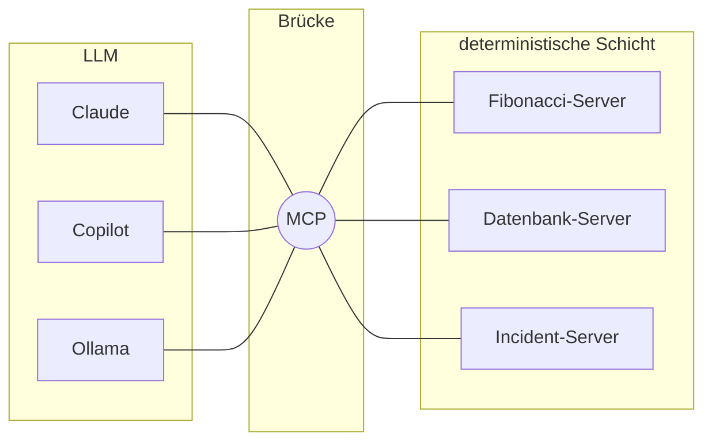

# Das MCP-Protokoll

## Fragen

- Es gibt mehrere Python-Bibliotheken für MCP, darunter [`pymcp`](https://pypi.org/project/pymcp/) und [`fastmcp`](https://pypi.org/project/fastmcp/). Schlage beide auf pypi.org nach. Welche würdest du wählen?

----

## Das N×M-Problem

Ohne Standard braucht jede KI-Anwendung eine eigene Integration für jedes Tool:
**N Anwendungen × M Tools = N·M Integrationen.**

Mit MCP implementiert jede Anwendung MCP einmal, und jedes Tool implementiert MCP einmal:
**N + M Integrationen.** MCP ist der *"USB-C-Anschluss für KI"*.


----

## MCP als Brücke

MCP ist eine Umsetzung des [Bridge Pattern](https://refactoring.guru/design-patterns/bridge):
es trennt die Abstraktion (was die KI tun will) von der Implementierung (wie ein System es tut), sodass **sich beide Seiten unabhängig voneinander ändern können**.



----

## Wie eine Konversation mit einem MCP-Service hinter den Kulissen aussieht:

Alle Nachrichten werden im Format **JSON-RPC 2.0** verschickt. Zuerst fragt der Client, welche Tools es gibt:

```json
{"jsonrpc": "2.0", "id": 1, "method": "tools/list"}
```

Der Server beschreibt jedes Tool mit einem JSON-Schema:

```json
{
  "name": "add",
  "description": "Add two numbers",
  "inputSchema": {
    "type": "object",
    "properties": {"a": {"type": "integer"}, "b": {"type": "integer"}},
    "required": ["a", "b"]
  }
}
```

Die Benutzerin fragt *"Was ist 17 + 25?"*. Das LLM wurde darauf trainiert, mit einem Tool-Aufruf zu antworten:

```json
{"name": "add", "arguments": {"a": 17, "b": 25}}
```

Der Client schickt ihn an den Server:

```json
{"jsonrpc": "2.0", "id": 2, "method": "tools/call",
 "params": {"name": "add", "arguments": {"a": 17, "b": 25}}}
```

----

### Reflexionsfragen

- Was sind die Unterschiede zwischen MCP, einer REST-API und dem direkten Aufruf von Python-Funktionen?
- Was sind gute Anwendungsfälle für jeden Ansatz?
