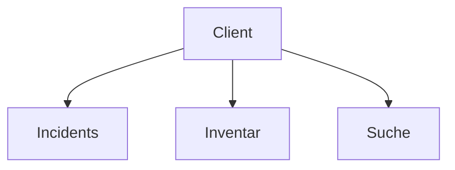
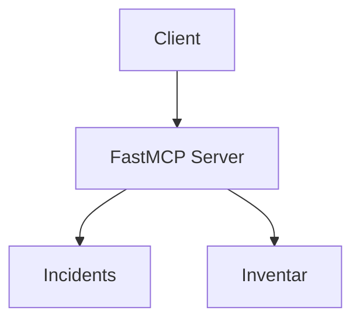
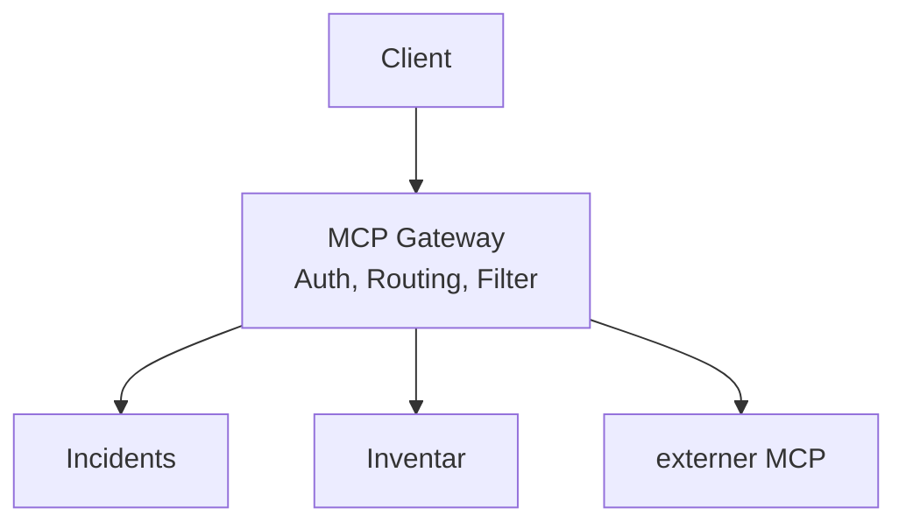

# Mehrere MCP Server

In der Praxis bleibt es selten bei einem Server.
Es gibt drei übliche Architekturen:


### Option 1: LLM--Client verbindet sich mit mehreren MCP-Servern



### Option 2: ein MCP-Server bietet mehrere Tool-Gruppen an



### Option 3: ein Gateway verbindet mehrere MCP-Server



----

## Übung 1: Server zusammensetzen

Mit `mount()` fügst du mehrere FastMCP Server zu einem zusammen.

Verbinde zwei MCP-Server über einen Gateway zu einem:

```python
from fastmcp import FastMCP

from fibonacci_mcp import mcp as fibonacci_mcp
from incident_mcp import mcp as incident_mcp

gateway = FastMCP("Gateway")
gateway.mount(incident_mcp, namespace="incidents")
gateway.mount(fibonacci_mcp, namespace="fibonacci")
```

Der `namespace` verhindert Namenskonflikte: Aus `create_incident` wird `incidents_create_incident`, aus `incident://{id}` wird `incident://incidents/{id}`.

Lösung: [code/gateway_mcp.py](code/gateway_mcp.py)


## Übung 2: Eine bestehende FastAPI-App als MCP veröffentlichen

`FastMCP.from_fastapi()` macht aus jedem Endpunkt einer FastAPI-App ein Tool:


```python
from inventory_api import app as inventory_app

inventory_mcp = FastMCP.from_fastapi(inventory_app, name="Inventory")
gateway.mount(inventory_mcp, namespace="inventory")
```


1. Lade [code/inventory_api.py](code/inventory_api.py) herunter.
2. Installiere FastAPI: `uv add fastapi uvicorn`
3. Füge die obigen Zeilen zum Gateway hinzu
4. Starte das Gateway und liste alle Tools auf:

   ```bash
   uv run gateway_mcp.py
   uv run fastmcp list http://localhost:8000/mcp
   ```

5. Frage ein LLM: *"Welche Geräte stehen am Ort von Incident 1?"*
   Verwendet es Tools aus beiden Servern?


## Übung 3: Tools filtern

Das Inventar enthält auch `delete_device`. Ein LLM sollte keine Geräte löschen dürfen.
Schließe alle `DELETE`-Endpunkte aus:

```python
from fastmcp.server.providers.openapi import MCPType, RouteMap

inventory_mcp = FastMCP.from_fastapi(
    inventory_app,
    route_maps=[RouteMap(methods=["DELETE"], mcp_type=MCPType.EXCLUDE)],
)
```

Wenn du eine eigene FastAPI-App hast (z.B. aus dem FastAPI-Kurs), veröffentliche sie auf die gleiche Weise.


Lösung: [code/gateway_mcp.py](code/gateway_mcp.py)
