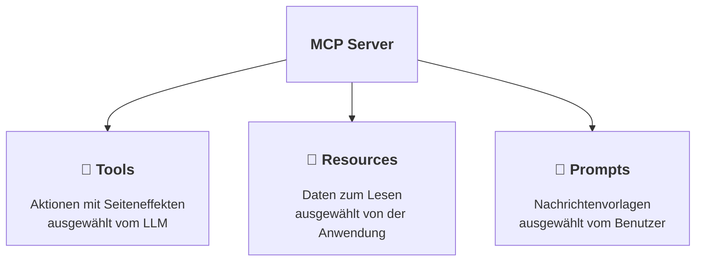

# Tools, Resources und Prompts

## Bausteine von MCP



| | Decorator | Beispiel | Wer entscheidet über die Verwendung |
|--|-----------|---------|-----------------------|
| **Tool** | `@mcp.tool` | berechnen, einen Incident anlegen, eine E-Mail senden | das LLM |
| **Resource** | `@mcp.resource("uri")` | Konfiguration, Status, eine Datei, ein Datenbankeintrag | die Anwendung / der Benutzer |
| **Prompt** | `@mcp.prompt` | "Reviewe diesen Code", "Schreibe eine Antwort an einen Kunden" | der Benutzer |

----

## Übung 1: Eine statische Resource hinzufügen

Erstelle eine neue Resource. Fülle sie mit einem Text, der die Fibonacci-Folge beschreibt:

```python
@mcp.resource("info://about")
def about() -> str:
    """Background information on the Fibonacci series."""
    return "The Fibonacci series starts with 0, 1. ..."
```

## Übung 2: Ein Resource Template hinzufügen

Das `{n}` in der URI wird zu einem Funktionsparameter:

```python
@mcp.resource("fibonacci://{n}")
def fibonacci_resource(n: int) -> dict:
    """The n-th Fibonacci number with its neighbours."""
    return {
        "n": n,
        "value": fibonacci(n),
        "next": fibonacci(n + 1),
    }
```

## Übung 3: Die Resources lesen

```bash
uv run fastmcp call http://localhost:8000/mcp info://about
uv run fastmcp call http://localhost:8000/mcp fibonacci://7
```

Sieh sie dir auch im MCP Inspector unter **Resources** und **Resource Templates** an.

Tippe in Claude Code `@`, um eine Resource an deinen Prompt anzuhängen.

----

## Übung 4: Ein Prompt Template hinzufügen

```python
@mcp.prompt
def explain_number(n: int) -> str:
    """Asks the LLM to explain a Fibonacci number to a child."""
    return (
        f"Calculate the Fibonacci number at position {n} using the tools. "
        "Then explain to a 10-year-old how it was calculated."
    )
```

Rendere den Prompt mit

```bash
uv run fastmcp call http://localhost:8000/mcp --prompt explain_number n=12
```

## Übung 5: Den Prompt in Claude Code verwenden

Tippe `/` in Claude Code. Suche deinen Prompt in der Liste (`/mcp__fibonacci__explain_number`) und führe ihn aus.

Lösung: [code/full_mcp.py](code/full_mcp.py)
